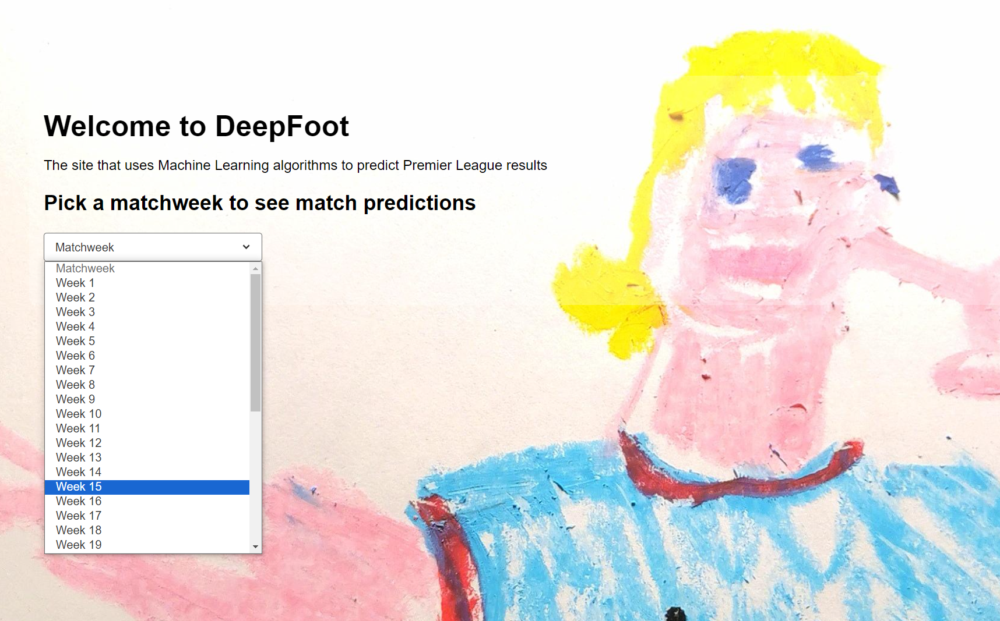
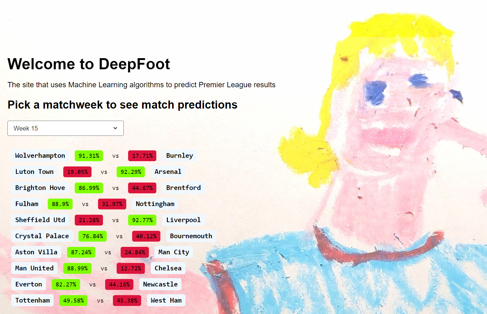
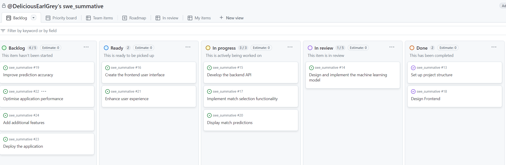
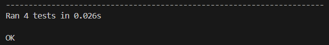
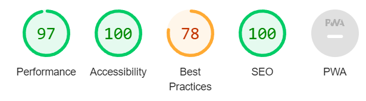
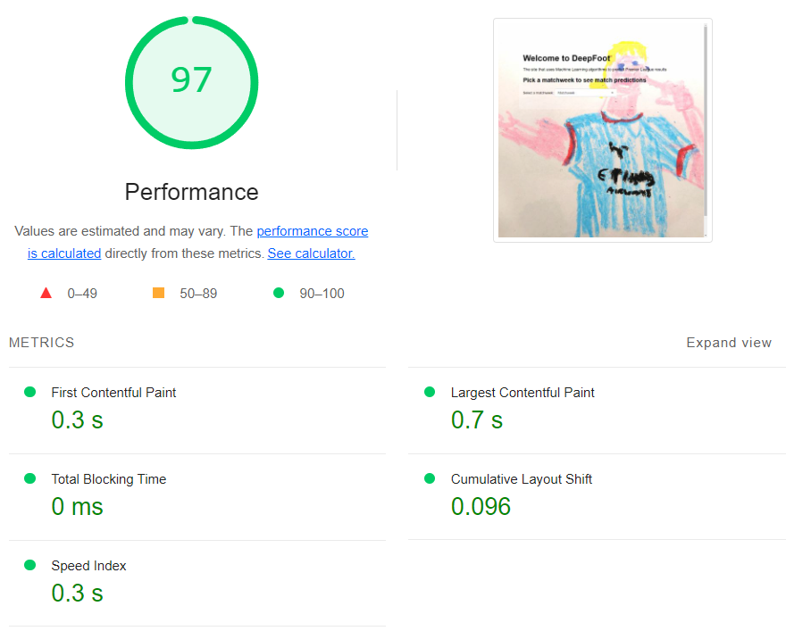
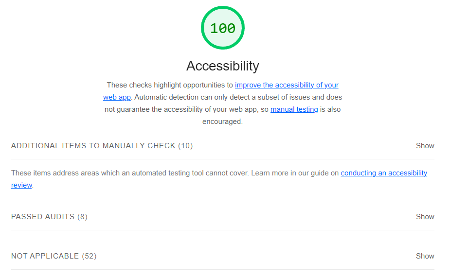
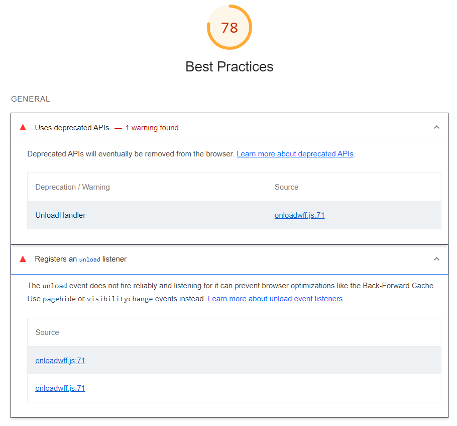
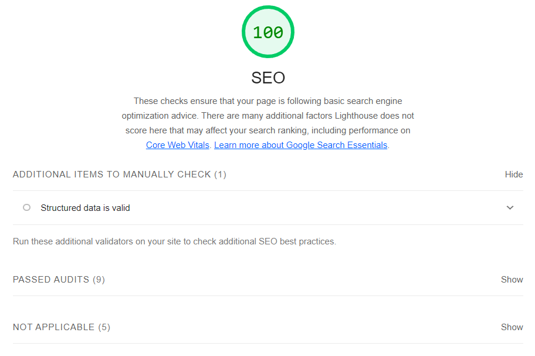

# swe_summative: DeepFoot

DeepFoot is an educational tool that showcases the potential of machine learning and web development technologies in creating interactive and predictive applications. It uses a machine learning model trained on historical Premier League match data to predict the outcomes of upcoming matches on a week-by-week basis.

The frontend of the application provides a user-friendly interface where users can select a specific matchweek and view the predicted results for each match. The predictions include the likelihood of a home win/draw or an away win/draw, expressed as percentages.

The backend invloves a logistic regression model trained on various features such as team performance, goals scored, and previous season points. The model is continuously updated with the latest match data (obtained via API calls to football-data.org) to provide accurate predictions.

DeepFoot is designed to be used as an educational resource, demonstrating how machine learning algorithms can be integrated with web technologies to create practical and interactive applications. It aims to inspire and educate individuals about the possibilities and potential of combining these technologies in solving real-world problems.

## Features

- Predicts the likelihood of a home win/draw or an away win/draw for each match in a selected matchweek
- Uses a logistic regression model trained on historical Premier League match data
- Provides a user-friendly web interface for selecting matchweeks and viewing predictions
- Displays team names, and prediction percentages for each match

## Installation

1. Clone the repository:
  ```git clone https://github.com/DeliciousEarlGrey/swe_summative.git```

2. Navigate to the project directory:
   ```cd swe_summative```

3. Install the required dependencies:
   ```pip install -r requirements.txt```

4. Run the application:
   ```python prediction_algorithm.py```

5. Open your web browser and visit `http://localhost:5000` to access the DeepFoot application.

## Usage

1. Select a matchweek from the dropdown menu on the homepage.
   
2. View the predicted results for each match, including team names and confidence percentages.
   


## Configuration

The following configuration options are available:

- `API_ENDPOINT`: The URL endpoint for retrieving football data (default: "https://api.football-data.org/v2/")
- `TRAINING_SEASONS`: The range of seasons to use for training the machine learning model (default: ["2021-22", "2022-23"])
- `PREDICTION_SEASON`: The season for which predictions are generated (default: "2023-24")


## License

This project is licensed under the [MIT License](LICENSE).

## Contact

If you have any questions, suggestions, or feedback, please feel free to get in touch.

## Feedback
[Cick here](https://docs.google.com/forms/d/e/1FAIpQLSfsMwCWWPhYYklwSqT3HUjzb94fkvBH9x0rgP8abqg20urFTg/viewform) to get involved with improving the app!

## Project Management Using KanBan in GitHub Projects
For this project I used the modern planning technique of kanban in GitHub Projects. This involves creating issues - which might be features, bugs, improvements or other asks - and tracking them as they progress from backlog - through 'ready', 'in progess', 'in review' - to 'done'. Below, I have highlighted what I learned from this process in terms of challenges, insights and reflections. The image below shows the kanban board during project development.

 

### Challenges
One of the challenges in planning a project like DeepFoot is determining the right scope and setting realistic goals. It's important to get a good balance between including essential features and not overcomplicating the project.

Estimating the time required for each task was slightly challenging, especially when dealing with new technologies or complex algorithms. It's crucial to break down tasks into smaller, manageable subtasks and allow for some additional time.

In a project like DeepFoot, there are dependencies between different tasks, such as integrating the machine learning model with the backend API, which proved challenging on occassion.

As the project progresses, new requirements or insights may emerge, leading to changes in the project scope or priorities. Being flexible and adaptable to these changes while maintaining the project's overall direction can be a challenge.

### Insights

Using GitHub Projects and issues lets us clearly communicate what we're working on. Detailed descriptions, comments, and regular updates help ensure the project is on track.

The Kanban board provides a visual representation of the project's progress, making it easier to identify bottlenecks, track the flow of work, and manage priorities. It helps in maintaining transparency and keeping everyone aligned.

Working on a project like DeepFoot involves learning and applying new technologies, such as machine learning and web development. Embracing a culture of continuous learning and knowledge sharing among team members is crucial for project success.

### Reflections
While initial planning is important, it's essential to recognise that planning is an ongoing process throughout the project. Regular reviews, retrospectives, and adaptations based on feedback and progress are necessary to keep the project on track.

Collaborating closely with team members, stakeholders, and end-users is important for the success of the project. Regularly seeking feedback, incorporating insights, and communicating well contribute to delivering a high-quality product.
The Kanban method promotes agility and flexibility in project management.


## Capturing Requirements
In order to capture requirements its important to understand the needs of all stakeholders and translate these needs into specific features and functionalities. In this case, we wanted to capture the needs of the users (people who want to learn about the potential for combining Machine Learning with webapp technologies), and administartors (those onvolved with hosting and funding the web application). This involved a process of stakeholder analysis, gathering user stories, defining functional requirements, determining data needs, defining technical architecture, developing prototypes, and reviewing feedback. This led to the following set of requirements, which have evolved over the course of the project. While most of these tasks have been completed, some of them, such as adding additional features, outline improvements that could be implemented in future iterations.

### Set up project structure

Create a new GitHub repository
Initialise the project with necessary files and folders
Set up a virtual environment for the project


### Design and implement the machine learning model

Research and select appropriate features for predicting match outcomes
Collect and preprocess historical Premier League match data
Train and evaluate different machine learning algorithms
Fine-tune and optimise the chosen model
Implement the final model in the project


### Develop the backend API

Design the API endpoints for retrieving predictions
Implement the API using a web framework (Flask)
Integrate the machine learning model with the API
Test and debug the API functionality


### Create the frontend user interface

Design the layout and components of the web application
Implement the user interface using HTML, CSS, and JavaScript
Integrate with the backend API to retrieve and display predictions
Implement user interactions and dynamic behavior


### Implement match selection functionality

Add a dropdown or selection mechanism for users to choose a specific matchweek
Retrieve the list of available matchweeks from the backend API
Update the user interface based on the selected matchweek


### Display match predictions

Retrieve the predicted outcomes for each match from the backend API
Present the predictions in a visually appealing and intuitive format
Include team names, logos, and prediction percentages
Highlight the predicted winner or draw


### Improve prediction accuracy

Gather feedback and analyze the performance of the machine learning model
Identify areas for improvement and collect additional relevant features
Retrain and update the model with new data and features
Monitor and evaluate the model's accuracy over time


### Enhance user experience

Implement responsive design to ensure compatibility across devices
Improve the visual aesthetics and layout of the application
Add loading indicators or progress bars for better user feedback
Implement error handling and user-friendly error messages


### Optimise application performance

Profile and analyze the performance bottlenecks
Implement caching mechanisms to speed up data retrieval
Optimize database queries and API responses
Minify and compress assets to reduce load times


### Deploy the application

Choose a suitable hosting platform (e.g., Heroku, AWS)
Configure the necessary environment variables and dependencies
Set up automatic deployment pipelines
Ensure the application is secure and scalable


### Add additional features

Implement user authentication and personalized predictions
Allow users to save their favorite teams or leagues
Provide historical data and trends for teams and matches
Integrate with external data sources for real-time updates

## Development
Here I will outline the step-by-step process for developing the DeepFoot project MVP from scratch.
Here's a step-by-step process for building the DeepFoot project from scratch:

### Project Setup

Create a new GitHub repository for the project.
Set up a virtual environment and install necessary dependencies.
Initialise the project structure and create required files and folders.


### Data Collection and Preprocessing

Identify and collect historical Premier League match data from reliable sources (e.g., APIs, websites, or datasets).
Clean and preprocess the data, handling missing values, inconsistencies, and formatting issues.
Explore and analyse the data to gain insights and identify relevant features for predicting match outcomes.


### Feature Engineering

Engineer meaningful features from the collected data, such as team performance metrics, head-to-head records, and form.
Create new features or transform existing ones to capture important information for predicting match outcomes.
Normalise or scale the features as needed to ensure fair comparison and improve model performance.


### Model Development

Split the preprocessed data into training and testing sets.
Choose an appropriate machine learning algorithm for predicting match outcomes (e.g., logistic regression, random forest, or neural networks).
Train the model using the training data and evaluate its performance using suitable metrics (e.g., accuracy, precision, recall, F1 score).
Fine-tune the model by adjusting hyperparameters, experimenting with different feature combinations, or trying alternative algorithms.


### Backend Development

Design and implement the backend API using a web framework (e.g., Flask or Django).
Define API endpoints for retrieving predictions, handling user requests, and serving data to the frontend.
Integrate the trained machine learning model into the backend, ensuring smooth communication between the model and the API.
Implement necessary data storage and retrieval mechanisms (e.g., using a database or caching system).


### Frontend Development

Design and create the user interface for the DeepFoot application using HTML, CSS, and JavaScript.
Develop interactive components, such as match selection dropdowns and prediction display sections.
Integrate the frontend with the backend API, enabling seamless communication and data exchange.
Implement user-friendly features, such as loading indicators, error handling, and responsive design.


### Testing and Debugging

Conduct thorough testing of the backend API and frontend functionality to identify and fix any bugs or issues.
Perform unit tests, integration tests, and end-to-end tests to ensure the application works as expected.
Test the machine learning model's predictions against real-world data and validate its accuracy and reliability.

## Testing
Testing for this project has been carried using the Python unittest package and Lighthouse for Chrome. The pupose of the unit tests in python is to ensure that the functions in the prediction_algorithm.py file work as expected. These tests are carried out on the following functions: ```calculate_form```, ```calculate_cumulative_goals```, ```calculate_cumulative_points```. The ```test_home_page``` test is used to ensure that the homepage is functioning as expected. The following image shows the successful completion of all tests:

 
 
The Lighthouse tests are an open-source, automated testing tool from Google that assess the quality of web pages. They include tests for:



Performance: Measures how quickly the page loads and becomes interactive.



Accessibility: Checks if the page is accessible to users with disabilities.



Best Practices: Verifies if the page follows web development best practices.



SEO: Analyzes if the page is optimized for search engine visibility.



We see that the webpage scored well across all metrics apart from Best Practices due to a deprecated API and an "unload" listener, which can disrupt the back-forward cache. This is something that should be addressed in the next iteration of this project.

## Evaluation

### Concept and Purpose

The project intends to showcase the integration of machine learning and web development. It addresses the problem of predicting football match outcomes. The educational aspect of the project is to provide a practical example for learning and understanding these technologies, aligning with the findings of Deo (2015) on the importance of hands-on projects in machine learning education.


### Technical Implementation

The project incorporates data preprocessing, feature engineering, machine learning model development, backend API, and frontend user interface. The project uses of Python and its libraries and the backend API is implemented using a web framework (Flask), which allows for smooth integration with the frontend, following the principles outlined by Grinberg (2018) in his book on Flask web development. The frontend user interface is designed using HTML, CSS, and JavaScript, providing an interactive and user-friendly experience, as outlined by Frain (2015) in his guide to responsive web design.


### Model Performance and Accuracy

The machine learning model used in the project (logistic regression) is suitable for binary classification tasks like predicting match outcomes. The model should be analysed against results and additional features could be added in order to improve accuracy (Hucaljuk and Rakipović, 2011).

### User Experience and Interface
The web interface is intuitive and easy to navigate, allowing users to select a matchweek and view the predicted outcomes. The presentation of the predicted results, including team names and prediction probabilities, and highlighng colours, makes it easier to read, consistent with the principles of user-centered design (Norman, 2013). The project could be improved with additional features, such as user authentication, personalised predictions, and more detailed match statistics.

### Code Quality and Best Practices
The project follows good coding practices, such as modular design, clear variable and function names, and appropriate comments (Martin, 2009). The use of version control (Git) and hosting the project on GitHub means the project follows industry-standard practices (Chacon and Straub, 2014). Unit tests are used for critical components meaning we get code reliability and maintainability (Percival, 2017). We could possibly improve the code further by following PEP 8 guidelines for Python code style and conducting code reviews.


### Scalability and Extensibility
The project uses scalable architecture. The backend API can handle multiple requests and the frontend can be easily extended with additional features, following the scalable design principles discussed by Bondi (2000) in his book on scalable and high-performance web sites.
Additionally, the modular allows for easy maintenance and future improvements (Fowler, 2018). Integrating with external data sources and expanding the project to cover other football leagues or sports could increase its scope and usability.

Overall, the DeepFoot project demonstrates the use of machine learning and web development technologies in predicting Premier League football match outcomes. It serves as an educational resource and provides a foundation for further improvements and extensions. With continued refinement and the addition of advanced features, the project has the potential to become a more comprehensive tool for football enthusiasts and data analysts.

## References
Bondi, A.B., 2000. Characteristics of scalability and their impact on performance. In: Proceedings of the 2nd international workshop on Software and performance, pp.195-203.

Chacon, S. and Straub, B., 2014. Pro Git. 2nd ed. Berkeley, CA: Apress.

Deo, N., 2015. Machine learning in medicine. Circulation, 132(20), pp.1920-1930.

Fowler, M., 2018. Refactoring: Improving the Design of Existing Code. 2nd ed. Boston, MA: Addison-Wesley Professional.

Frain, B., 2015. Responsive Web Design with HTML5 and CSS3. 2nd ed. Birmingham, UK: Packt Publishing.

Grinberg, M., 2018. Flask Web Development: Developing Web Applications with Python. 2nd ed. Sebastopol, CA: O'Reilly Media.

Hucaljuk, J. and Rakipović, A., 2011, May. Predicting football scores using machine learning techniques. In: 2011 Proceedings of the 34th International Convention MIPRO, pp.1623-1627. IEEE.

Martin, R.C., 2009. Clean Code: A Handbook of Agile Software Craftsmanship. Upper Saddle River, NJ: Prentice Hall.

Norman, D., 2013. The Design of Everyday Things. Revised and expanded ed. New York, NY: Basic Books.

Percival, H., 2017. Test-Driven Development with Python: Obey the Testing Goat: Using Django, Selenium, and JavaScript. 2nd ed. Sebastopol, CA: O'Reilly Media.
