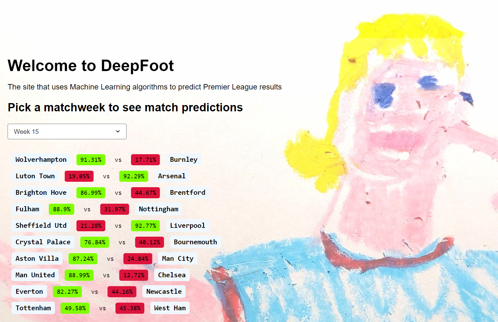

# swe_summative: DeepFoot

DeepFoot is an educational tool that showcases the potential of machine learning and web development technologies in creating interactive and predictive applications. It uses a machine learning model trained on historical Premier League match data to predict the outcomes of upcoming matches on a week-by-week basis.

The frontend of the application provides a user-friendly interface where users can select a specific matchweek and view the predicted results for each match. The predictions include the likelihood of a home win/draw or an away win/draw, expressed as percentages.

The backend invloves a logistic regression model trained on various features such as team performance, goals scored, and previous season points. The model is continuously updated with the latest match data (obtained via API calls to football-data.org) to provide accurate predictions.

DeepFoot is designed to be used as an educational resource, demonstrating how machine learning algorithms can be integrated with web technologies to create practical and interactive applications. It aims to inspire and educate individuals about the possibilities and potential of combining these technologies in solving real-world problems.

## Features

- Predicts the likelihood of a home win/draw or an away win/draw for each match in a selected matchweek
- Uses a logistic regression model trained on historical Premier League match data
- Provides a user-friendly web interface for selecting matchweeks and viewing predictions
- Displays team names, and prediction percentages for each match

## Installation

1. Clone the repository:
  ```git clone https://github.com/DeliciousEarlGrey/swe_summative.git```

2. Navigate to the project directory:
   ```cd swe_summative```

3. Install the required dependencies:
   ```pip install -r requirements.txt```

4. Run the application:
   ```python prediction_algorithm.py```

5. Open your web browser and visit `http://localhost:5000` to access the DeepFoot application.

## Usage

1. Select a matchweek from the dropdown menu on the homepage.
   
2. View the predicted results for each match, including team names and confidence percentages.
   


## Configuration

The following configuration options are available:

- `API_ENDPOINT`: The URL endpoint for retrieving football data (default: "https://api.football-data.org/v2/")
- `TRAINING_SEASONS`: The range of seasons to use for training the machine learning model (default: ["2021-22", "2022-23"])
- `PREDICTION_SEASON`: The season for which predictions are generated (default: "2023-24")


## License

This project is licensed under the [MIT License](LICENSE).

## Contact

If you have any questions, suggestions, or feedback, please feel free to get in touch.

## Feedback
[Cick here](https://docs.google.com/forms/d/e/1FAIpQLSfsMwCWWPhYYklwSqT3HUjzb94fkvBH9x0rgP8abqg20urFTg/viewform) to get involved with improving the app!

## Project Management Using KanBan in GitHub Projects
For this project I used the modern planning technique of kanban in GitHub Projects. This involves creating issues - which might be features, bugs, improvements or other asks - and tracking them as they progress from backlog - through 'ready', 'in progess', 'in review' - to 'done'. Below, I have highlighted what I learned from this process in terms of challenges, insights and reflections.

### Challenges
One of the challenges in planning a project like DeepFoot is determining the right scope and setting realistic goals. It's important to get a good balance between including essential features and not overcomplicating the project.

Estimating the time required for each task was slightly challenging, especially when dealing with new technologies or complex algorithms. It's crucial to break down tasks into smaller, manageable subtasks and allow for some additional time.

In a project like DeepFoot, there are dependencies between different tasks, such as integrating the machine learning model with the backend API, which proved challenging on occassion.

As the project progresses, new requirements or insights may emerge, leading to changes in the project scope or priorities. Being flexible and adaptable to these changes while maintaining the project's overall direction can be a challenge.

### Insights

Using GitHub Projects and issues lets us clearly communicate what we're working on. Detailed descriptions, comments, and regular updates help ensure the project is on track.

The Kanban board provides a visual representation of the project's progress, making it easier to identify bottlenecks, track the flow of work, and manage priorities. It helps in maintaining transparency and keeping everyone aligned.

Working on a project like DeepFoot involves learning and applying new technologies, such as machine learning and web development. Embracing a culture of continuous learning and knowledge sharing among team members is crucial for project success.

### Reflections
While initial planning is important, it's essential to recognise that planning is an ongoing process throughout the project. Regular reviews, retrospectives, and adaptations based on feedback and progress are necessary to keep the project on track.

Collaborating closely with team members, stakeholders, and end-users is important for the success of the project. Regularly seeking feedback, incorporating insights, and communicating well contribute to delivering a high-quality product.
The Kanban method promotes agility and flexibility in project management.

